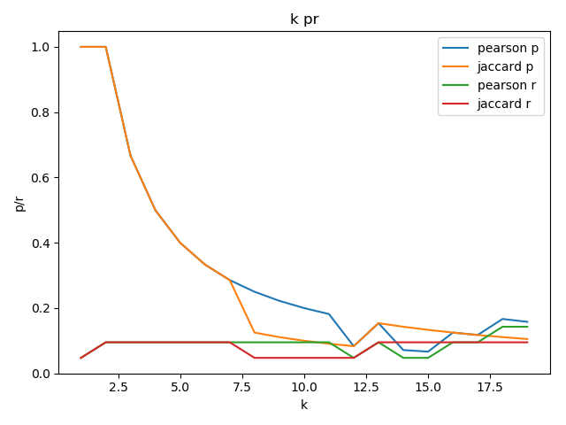

# v2

## 数据描述

近800的用户，对于1300个模板在17年4月到11月，8个月内的预览记录。

## 依据个人历史记录预测

两种思路，一种是时序推荐，一种是基于某种逻辑直接进行普通推荐。

容易陷入局部最优解

### 时序推荐

效果不忍直视。不做了。

### 普通推荐

普通推荐，非常简单，就是基于历史预览策略进行推荐。
思路就是把个人的预览历史中的模板，生成一个针对个人的热度排行。完全不依赖别的用户，只从自身的历史预览记录中提取。

设计一个普通推荐的思路：

* 先完全按照预览次数进行排序，然后前 k 个 被当做预测的模板。

p r 随着 k 值的变化如图：


通常情况下因为：

```python3
    # 准确率 = 提取出的正确信息条数 /  提取出的信息条数
    p = num_precision_tpl / num_predict_tpl
    # 召回率 = 提取出的正确信息条数 /  样本中的信息条数
    r = num_precision_tpl / num_real_preview
    # f1 F值  = 正确率 * 召回率 * 2 / (正确率 + 召回率) （F 值即为正确率和召回率的调和平均值）
```

所以，一个良好的模型，随着 k 值的增大，预测出的数据中不准确的数据也在增加，p 应该是 从 1 逐渐降低的，r 应该是从 0 逐渐增大的。

从图上看，这样的模型显然不好。

* 个人兴趣程度的排序

上面那个只是一个总体的热度，假如模板 T1 被100人预览了1000次，其中用户 A 预览了10次；T2 被 2 人预览了 5 次，其中用户 A 预览了 4 次，那么显然，用户 A 对模板 T2 可能更感兴趣。

为了平衡这种关系，我们假定一种个人兴趣程度的计算逻辑。

w = 个人预览次数/模板预览的人数

结果如图:


稍微好了一点。
当 k 取值3~4的时候，结果比较好一点。

## 基于用户的协同过滤推荐

在 v1 中也提到过了，主要是进行优化。
进行优化的部分：

1. 优化用户对模板的兴趣程度的算法
2. 分为测试集和训练集，防止过度拟合
3. 优化相似度的计算

### 优化兴趣程度算法

测试发现，去除遗忘因子的影响，计算用户相似度甚至更准确，可能是之前对于遗忘因子的模拟不准确。
去除遗忘因子。

### 分测试集和训练集

分测试集和训练集的目的只是为了防止过度拟合，而我们的数据是时序的数据，因此只要比较预测不同时间的模型评分就可以判断出是否有严重的过度拟合现象。

### 相似度的计算

#### [皮尔逊相关系数](https://en.wikipedia.org/wiki/Pearson_correlation_coefficient)

v1 中使用的就是，不再多做介绍

#### [Jaccard相似度](https://en.wikipedia.org/wiki/Jaccard_index)

简介，可见wiki。

```python3
    if a != 0 or b != 0:
        union += 1
        if a != 0 and b != 0:
            intersect += 1
```

```shell
data cf
pearson:

[(333, 0.5906341355087884), (386, 0.5397226254363309), (574, 0.4860351668574924), (534, 0.4258154171719675), (142, 0.41818254166450153), (151, 0.41356746741880185)]
[(83, 1.5517499011974871), (14, 1.5212183991676231), (126, 1.231347601412861), (41, 1.016597767097507), (72, 0.9981374701147083)]
p: 0.4  r: 0.16666666666666666 f1: 0.23529411764705882
jaccard:

[(333, 0.3888888888888889), (386, 0.35384615384615387), (574, 0.33962264150943394), (534, 0.2962962962962963), (449, 0.2857142857142857), (643, 0.2553191489361702)]
[(83, 1.5510900862968309), (14, 1.3871814968563265), (126, 1.0499675265632715), (41, 0.9930734772163918), (72, 0.8714929301039298)]
p: 0.4  r: 0.16666666666666666 f1: 0.23529411764705882
```

实验的结果差不多，都并不是十分理想。

当使用前30天的数据，预测接下来5天的预览模板时：随着k值的变化，准确率和召回率如图。




综合尝试多组，当k取3~4的时候，效果是最好的。

## 算法加权取结果

实际使用中，采用预测和推荐一起的结果。
